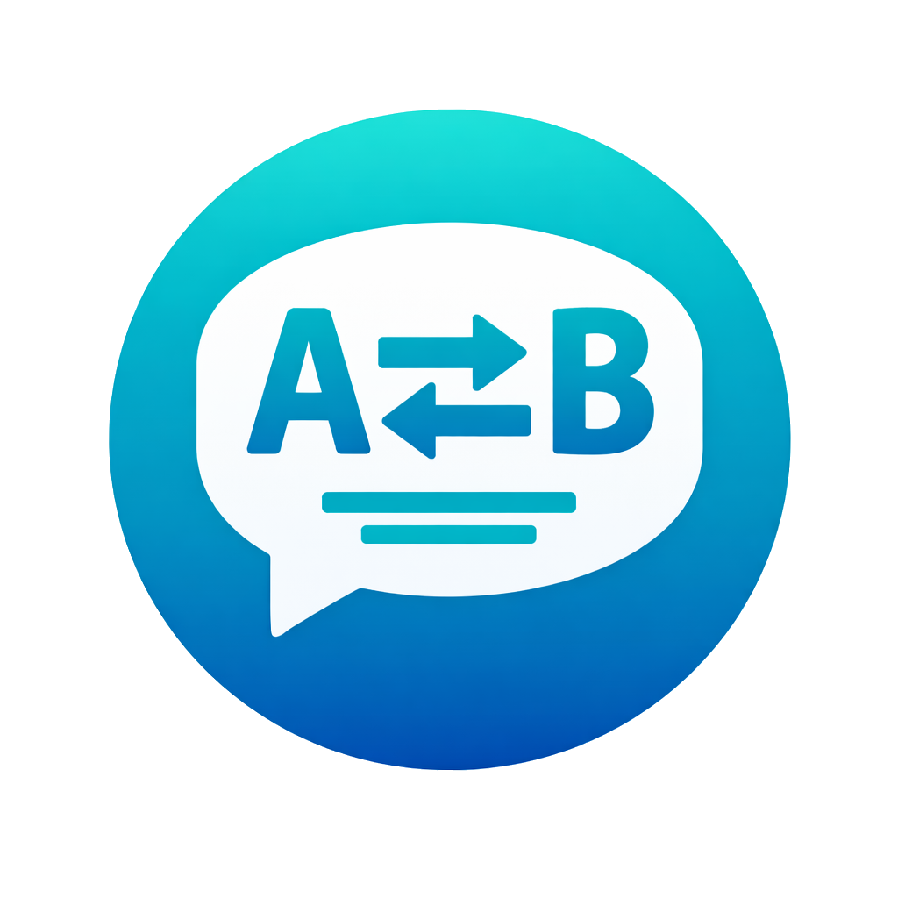

<div align="center">

# Sublarr



### Subtitle Manager & Auto-Translator for Anime and Media

*arr-compatible · LLM-powered · Self-hosted · Open Source

[](https://github.com/Abrechen2/sublarr/releases)
[](LICENSE)
[](https://www.python.org/)
[](https://react.dev/)
[](https://github.com/Abrechen2/sublarr/pkgs/container/sublarr)

---

**[Quick Start](#-quick-start)** · **[Configuration](#️-configuration)** · **[Integrations](#-integrations)** · **[Docs](#-documentation)**

</div>

---

Sublarr is a self-hosted subtitle manager for anime and media libraries. It automatically searches subtitle providers, scores and downloads the best match (ASS-first), and translates subtitles into your target language using a local LLM — all without sending your data to third-party services.

It follows the *arr-suite design philosophy: connect it to Sonarr/Radarr, set up your language profiles, and let it handle everything automatically via webhooks.

---

## ☕ Support This Project

If Sublarr saves you time, please consider supporting continued development:

<a href="https://www.paypal.com/donate?hosted_button_id=GLXYTD3FV9Y78">
  
</a>

<!-- Alternatively: https://github.com/sponsors/Abrechen2 -->

---

## ✨ Features

### 🔍 Subtitle Search & Download
- **11 providers** — AnimeTosho, Jimaku, OpenSubtitles, SubDL + 7 plugin providers
- **ASS-first scoring** — ASS/SSA gets +50 bonus over SRT; dialect, sync quality, and uploader reputation scored
- **Smart deduplication** — avoids re-downloading identical files via SHA-256 hashing
- **Machine translation detection** — flags OpenSubtitles mt/ai-tagged uploads with an orange badge
- **Uploader trust scoring** — 0–20 bonus based on provider rank (emerald badge for top uploaders)
- **Parallel provider search** — all providers queried concurrently via `ThreadPoolExecutor`
- **Circuit breakers** — per-provider CLOSED/OPEN/HALF_OPEN state prevents cascading failures

### 🌐 LLM Translation
- **Fully local** — translates via [Ollama](https://ollama.ai/); no external API required
- **Context-aware batching** — cues grouped into context-window-aware chunks for coherent translations
- **Translation memory** — SHA-256 + difflib similarity cache avoids retranslating identical/near-identical lines
- **Per-line quality scoring** — optional LLM pass scores each translated line (0–10), retries low-scoring lines
- **Prompt presets** — 5 built-in templates (Anime, Documentary, Casual…) + custom presets
- **Language profiles** — per-series/film target language rules with multiple languages per profile

### 📺 *arr & Media Server Integration
- **Sonarr & Radarr webhooks** — automatically processes new episodes and movies on import
- **Multi-instance support** — connect multiple Sonarr/Radarr/Jellyfin/Emby instances
- **Jellyfin / Emby / Plex / Kodi** — triggers library refresh after subtitle completion
- **Tag-based profile assignment** — Sonarr/Radarr tags automatically assign language profiles
- **AniDB absolute episode order** — correct episode numbering for anime with alternate orders (e.g. Haruhi)
- **Path mapping** — supports remote *arr setups where file paths differ between hosts

### 🔧 Subtitle Tools
- **Waveform editor** — wavesurfer.js audio visualization with per-cue region markers
- **CodeMirror editor** — syntax-highlighted ASS/SRT editing with diff view
- **Video sync** — ffsubsync & alass integration for automatic timing correction
- **Format conversion** — convert between ASS, SRT, VTT, SSA via pysubs2
- **Quality fixes** — one-click overlap fix, timing normalization, line merge/split, spell-check
- **Batch OCR** — extract text from PGS/VobSub image tracks via Tesseract
- **Whisper fallback** — generate subtitles from audio when no text subs exist

### 🖥️ Wanted & Automation
- **Wanted scanner** — detects all episodes/movies missing subtitles in your Jellyfin/Emby library
- **Scheduled scanning** — configurable interval (default: every 6 hours)
- **Subtitle upgrade system** — automatically replaces low-quality subs when a better version appears
- **Batch search** — run searches across all wanted items in one click
- **Anime-only mode** — optionally limit wanted scanning to anime series

### 🎨 UI
- *arr-style dark theme with teal accent — feels at home next to Sonarr, Radarr, Prowlarr
- Customizable dashboard with draggable widgets
- Global search (`Ctrl+K`) across all pages
- Real-time updates via WebSocket (activity feed, job progress)
- Keyboard shortcuts throughout (`?` to view all)

---

## 🚀 Quick Start

```bash
# 1. Copy environment file
cp .env.example .env

# 2. Edit .env — set your media path and Ollama URL at minimum
nano .env

# 3. Start
docker compose up -d
```

Open **http://localhost:5765** — that's it.

> **First-time setup:** Go to *Settings → Providers* to add your API keys, then *Settings → Translation* to configure your Ollama model and language profile.

---

## 🐳 Docker

### Minimal `docker-compose.yml`

```yaml
services:
  sublarr:
    image: ghcr.io/abrechen2/sublarr:0.11.0-beta
    container_name: sublarr
    ports:
      - "5765:5765"
    volumes:
      - ./config:/config        # database, backups, logs
      - /path/to/media:/media   # your media library (same path as Jellyfin/Emby sees)
    environment:
      - PUID=1000
      - PGID=1000
      - SUBLARR_MEDIA_PATH=/media
      - SUBLARR_OLLAMA_URL=http://host.docker.internal:11434
      - SUBLARR_OLLAMA_MODEL=qwen2.5:14b-instruct
    restart: unless-stopped
```

### Production Hardening

The image runs as a non-root user with `cap_drop: ALL` and no new privileges. A full production example with resource limits:

```yaml
services:
  sublarr:
    image: ghcr.io/abrechen2/sublarr:0.11.0-beta
    container_name: sublarr
    ports:
      - "5765:5765"
    volumes:
      - ./config:/config
      - /mnt/media:/media:rw
    env_file: .env
    restart: unless-stopped
    deploy:
      resources:
        limits:
          cpus: '2.0'
          memory: 4G
        reservations:
          cpus: '0.5'
          memory: 512M
    cap_drop:
      - ALL
    cap_add:
      - CHOWN
      - DAC_OVERRIDE
      - SETGID
      - SETUID
    security_opt:
      - no-new-privileges:true
    healthcheck:
      test: ["CMD", "curl", "-f", "http://localhost:5765/api/v1/health"]
      interval: 30s
      timeout: 10s
      retries: 3
    logging:
      driver: "json-file"
      options:
        max-size: "10m"
        max-file: "3"
```

### User / Group IDs

Sublarr runs as a non-root user inside the container. Set `PUID` and `PGID` to match your host user so volume file permissions work correctly:

```bash
id $USER          # → uid=1000(you) gid=1000(you)
# then set PUID=1000 PGID=1000 in .env
```

---

## ⚙️ Configuration

All settings use the `SUBLARR_` prefix. They can be set via environment variables, `.env` file, or the Settings UI at runtime (stored in the database).

### Core

| Variable | Default | Description |
|---|---|---|
| `SUBLARR_MEDIA_PATH` | `/media` | Root path of your media library |
| `SUBLARR_DB_PATH` | `/config/sublarr.db` | SQLite database location |
| `SUBLARR_PORT` | `5765` | HTTP port |
| `SUBLARR_API_KEY` | *(empty)* | Optional API key for auth (`X-Api-Key` header) |
| `SUBLARR_LOG_LEVEL` | `INFO` | Log level (`DEBUG`, `INFO`, `WARNING`, `ERROR`) |
| `PUID` / `PGID` | `1000` | Container user/group IDs |

### Translation

| Variable | Default | Description |
|---|---|---|
| `SUBLARR_OLLAMA_URL` | `http://localhost:11434` | Ollama base URL |
| `SUBLARR_OLLAMA_MODEL` | `qwen2.5:14b-instruct` | Model for translation |
| `SUBLARR_SOURCE_LANGUAGE` | `en` | Source subtitle language |
| `SUBLARR_TARGET_LANGUAGE` | `de` | Default target language |
| `SUBLARR_BATCH_SIZE` | `15` | Subtitle cues per LLM call |
| `SUBLARR_TEMPERATURE` | `0.3` | LLM temperature (lower = more consistent) |

### Provider API Keys

| Variable | Provider |
|---|---|
| `SUBLARR_OPENSUBTITLES_API_KEY` | [OpenSubtitles](https://www.opensubtitles.com/en/consumers) |
| `SUBLARR_JIMAKU_API_KEY` | [Jimaku](https://jimaku.cc/) |
| `SUBLARR_SUBDL_API_KEY` | [SubDL](https://subdl.com/) |

AnimeTosho works without an API key.

### Automation

| Variable | Default | Description |
|---|---|---|
| `SUBLARR_WANTED_SCAN_INTERVAL_HOURS` | `6` | How often to scan for missing subs |
| `SUBLARR_WANTED_SCAN_ON_STARTUP` | `true` | Run scan when container starts |
| `SUBLARR_WANTED_ANIME_ONLY` | `true` | Only scan anime series |
| `SUBLARR_WEBHOOK_AUTO_TRANSLATE` | `true` | Auto-translate after webhook download |
| `SUBLARR_UPGRADE_ENABLED` | `true` | Replace low-quality subs with better versions |

### Path Mapping (remote *arr hosts)

If your Sonarr/Radarr runs on a different host and uses different paths than Sublarr:

```env
SUBLARR_PATH_MAPPING=/data/media=/mnt/media
```

See [docs/CONFIGURATION.md](docs/CONFIGURATION.md) for the complete variable reference.

---

## 🔌 Integrations

### Sonarr & Radarr

1. In Sonarr/Radarr: *Settings → Connect → Add → Webhook*
2. URL: `http://sublarr:5765/api/v1/webhook/sonarr` (or `/radarr`)
3. Events: ✅ On Import, ✅ On Upgrade
4. (Optional) Set `SUBLARR_SONARR_URL` + `SUBLARR_SONARR_API_KEY` for library refresh

Sublarr will automatically download and translate subtitles for every new import.

### Jellyfin / Emby

1. *Sublarr → Settings → Media Servers → Add*
2. Enter your server URL and API key
3. Sublarr will trigger a library refresh after each subtitle download

### Ollama (Local LLM)

```bash
# Install a translation model (recommended for subtitle translation)
ollama pull qwen2.5:14b-instruct

# Or a smaller/faster alternative
ollama pull qwen2.5:7b-instruct
```

Set `SUBLARR_OLLAMA_URL` to your Ollama host. For Docker, use `http://host.docker.internal:11434`.

---

## 🖥️ UI Overview

| Page | Description |
|---|---|
| **Dashboard** | Customizable widget grid — status, queue, recent activity |
| **Library** | All series/movies with subtitle progress and bulk actions |
| **Wanted** | Missing subtitle queue with one-click search |
| **Queue** | Live job progress (downloading, translating, syncing) |
| **Activity** | Real-time event feed |
| **History** | Past operations with timestamps and results |
| **Statistics** | Charts — provider success rates, language distribution, quality trends |
| **Settings** | 19-tab settings panel covering all configuration |

The subtitle editor (accessible from Library/Series Detail) includes:
- **Preview** — formatted subtitle preview with cue navigation
- **Editor** — CodeMirror syntax-highlighted ASS/SRT editing
- **Diff** — side-by-side comparison with the saved version
- **Waveform** — audio visualization with per-cue region markers

---

## 💻 Development

```bash
# First-time setup (installs Python + Node dependencies, optional pre-commit hooks)
npm run setup:sh      # Linux/Mac
npm run setup:ps1     # Windows PowerShell

# Start backend (:5765) + frontend (:5173) in parallel
npm run dev

# Tests
cd backend && python -m pytest
cd frontend && npm test

# Lint & type check
cd backend && ruff check . && mypy .
cd frontend && npm run lint && npx tsc --noEmit
```

---

## 📚 Documentation

| Document | Description |
|---|---|
| [docs/USER-GUIDE.md](docs/USER-GUIDE.md) | End-user guide — all features explained with examples |
| [docs/CONFIGURATION.md](docs/CONFIGURATION.md) | Full `SUBLARR_*` variable reference |
| [docs/INTEGRATIONS.md](docs/INTEGRATIONS.md) | Sonarr, Radarr, Jellyfin, Emby, Plex, Kodi setup walkthroughs |
| [docs/FAQ.md](docs/FAQ.md) | Frequently asked questions |
| [docs/LANGUAGE-PROFILES.md](docs/LANGUAGE-PROFILES.md) | Language profile system — per-series target language rules |
| [docs/SCORING.md](docs/SCORING.md) | Subtitle scoring algorithm — how candidates are ranked |
| [docs/DATABASE-SCHEMA.md](docs/DATABASE-SCHEMA.md) | Database tables and schema reference |
| [docs/REVERSE-PROXY.md](docs/REVERSE-PROXY.md) | Nginx and Traefik reverse proxy setup |
| [docs/PERFORMANCE-TUNING.md](docs/PERFORMANCE-TUNING.md) | Performance optimization for large libraries |
| [docs/PROVIDERS.md](docs/PROVIDERS.md) | Provider system, scoring algorithm, adding custom providers |
| [docs/ARCHITECTURE.md](docs/ARCHITECTURE.md) | System design, data flow, component overview |
| [docs/API.md](docs/API.md) | Full REST API reference (`/api/v1/`) |
| [docs/PLUGIN_DEVELOPMENT.md](docs/PLUGIN_DEVELOPMENT.md) | Writing subtitle provider plugins |
| [docs/CONTRIBUTING.md](docs/CONTRIBUTING.md) | Code style, testing, PR workflow |
| [docs/TROUBLESHOOTING.md](docs/TROUBLESHOOTING.md) | Common issues and solutions |
| [docs/MIGRATION.md](docs/MIGRATION.md) | Upgrading between versions |
| [ROADMAP.md](ROADMAP.md) | Feature roadmap and version planning |
| [CHANGELOG.md](CHANGELOG.md) | Release notes |
| [.env.example](.env.example) | All configurable environment variables |

---

## 🤝 Contributing

Contributions are welcome — bug reports, feature requests, and pull requests.

1. **Bug reports** → open a GitHub Issue with your log output and config
2. **Feature requests** → open a Discussion so we can talk through the approach first
3. **Pull requests** → see [docs/CONTRIBUTING.md](docs/CONTRIBUTING.md) for code style, testing requirements, and commit format

---

## 📄 License

GPL-3.0 — see [LICENSE](LICENSE).

Sublarr is not affiliated with the *arr project or any subtitle provider.

---

<div align="center">

Made with ☕ for the self-hosting community

<a href="https://www.paypal.com/donate?hosted_button_id=GLXYTD3FV9Y78">
  
</a>

</div>
