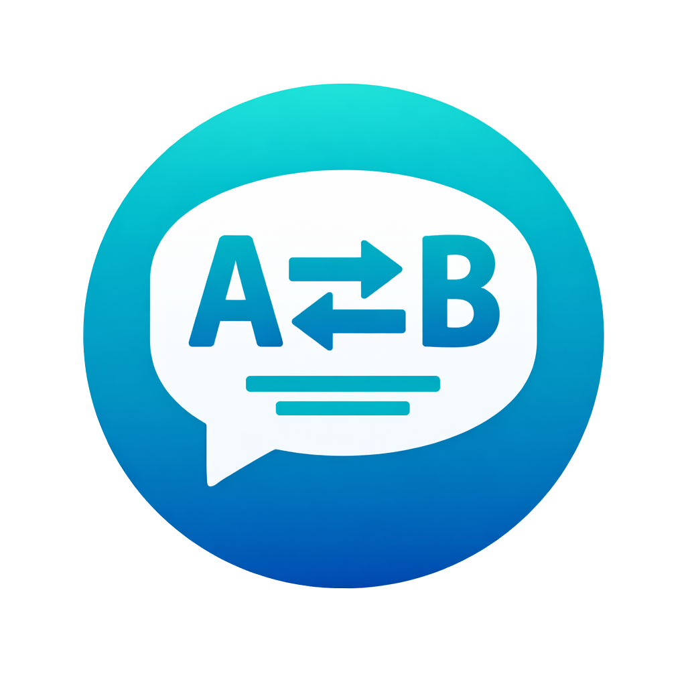

<div align="center">

# Sublarr



### Subtitle Manager & Downloader for Anime and Media

*arr-compatible · Self-hosted · Open Source · Anime-first scoring

[](https://github.com/Abrechen2/sublarr/releases)
[](LICENSE)
[](https://www.python.org/)
[](https://react.dev/)
[](https://github.com/Abrechen2/sublarr/pkgs/container/sublarr)

---

**[Quick Start](#-quick-start)** · **[Configuration](#️-configuration)** · **[Integrations](#-integrations)** · **[Website](https://sublarr.de)** · **[Docs](https://sublarr.de/docs/)**

**Community:** [Discord](https://discord.gg/WjatsKzHXz) · [Reddit r/Sublarr](https://www.reddit.com/r/Sublarr/) · [GitHub Issues](https://github.com/Abrechen2/sublarr/issues)

</div>

---

Sublarr is a self-hosted subtitle manager for anime and media libraries. It automatically searches subtitle providers, scores and downloads the best match (ASS-first), and gives you tools to edit, sync and convert subtitles — all on your LAN, no cloud required.

It follows the *arr-suite design philosophy: connect it to Sonarr/Radarr, set up your language profiles, and let it handle everything automatically via webhooks. Or run it standalone — no *arr setup required.

> [!NOTE]
> **V1.0 — stable core.** The subtitle search, scoring, download and *arr-integration paths are stable. **LLM translation remains experimental** (see below). Always keep backups of your subtitle files before enabling automation, and read the [CHANGELOG](CHANGELOG.md) before upgrading. Solo-maintained project — bug reports and contributions welcome.

---

## ✨ Features

### What's core vs. what's beta

| Feature | Status |
|---------|--------|
| Subtitle search & download (21 providers + embedded extraction) | Core — most-tested path |
| ASS-first scoring, deduplication, trust scoring | Core — most-tested path |
| Sonarr/Radarr webhook integration | Core — most-tested path |
| Standalone mode (no *arr required) | Core — filesystem watching + NFO metadata |
| Language profiles (mustContain, cutoff, audioExclude) | Core — functional |
| Subtitle editor, waveform sync, format conversion | Core — functional, rough edges possible |
| Post-download processing pipeline | Core — functional |
| **LLM translation via Ollama / DeepL / Google** | **⚠️ Beta — experimental, quality varies** |

### 🔍 Subtitle Search & Download
- **21 providers** — AnimeTosho, Jimaku, OpenSubtitles, SubDL, Subscene, Subf2m, Subsource, SubsDump, Addic7ed, BetaSeries, Titlovi, Titrari, TVSubtitles, Gestdown, Kitsunekko, Napisy24, Podnapisi, YIFY, Zimuku, LegendasDivX, TurkceAltyazi — plus embedded subtitle extraction
- **ASS-first scoring** — ASS/SSA gets +50 bonus over SRT; format, dialect, sync quality, and uploader reputation scored
- **Smart deduplication** — avoids re-downloading identical files via SHA-256 hashing
- **Machine translation detection** — flags OpenSubtitles mt/ai-tagged uploads with an orange badge
- **Uploader trust scoring** — 0–20 bonus based on provider rank (emerald badge for top uploaders)
- **Score breakdown** — hover tooltip on score badges shows per-component point breakdown
- **Parallel provider search** — all providers queried concurrently via `ThreadPoolExecutor`
- **Circuit breakers** — per-provider CLOSED/OPEN/HALF_OPEN state prevents cascading failures; state persisted across restarts
- **Language profiles** — per-series/film target language rules; mustContain / mustNotContain filters, cutoff (stop searching once found), audioExclude (skip if audio already matches target)

### 📺 *arr & Media Server Integration
- **Sonarr & Radarr webhooks** — automatically processes new episodes and movies on import
- **Multi-instance support** — connect multiple Sonarr/Radarr/Jellyfin/Emby instances
- **Jellyfin / Emby / Plex / Kodi** — triggers library refresh after subtitle completion
- **Tag-based profile assignment** — Sonarr/Radarr tags automatically assign language profiles
- **AniDB absolute episode order** — correct episode numbering for anime with alternate orders (e.g. Haruhi)
- **Anime multi-season fallback** — OpenSubtitles season-1 collapse for anime indexed without season split
- **Path mapping** — supports remote *arr setups where file paths differ between hosts

### 🗂️ Standalone Mode (no *arr required)
- **Filesystem watching** — monitors configured folders; automatically adds new video files to the wanted list
- **NFO metadata** — reads `.nfo` sidecar files to resolve series/movie title, TVDB/TMDB IDs without API calls
- **Auto-mode** — when no *arr is configured, Sublarr activates standalone mode automatically on startup
- **Extras skipping** — trailers, samples, featurettes excluded from subtitle discovery
- **Symlink support** — follows symlinked directories during scan

### 🔧 Subtitle Tools
- **Waveform editor (Aegisub-class)** — drag region edges to retime cues, click-set start/end (`S` / `D` keys), snap to keyframes / scene cuts / neighbour cues with priority-tied tie-breaking, gap & overlap quality markers, vertical amplitude zoom (1×–5×), pitch-preserving playback rate (0.5×–2×), sticky time-axis ruler, optional spectrogram overlay, optional audio-scrub-while-dragging, multi-audio-track picker, ASS karaoke syllable overlay
- **CodeMirror editor** — syntax-highlighted ASS/SRT editing with diff view
- **Video sync** — ffsubsync & alass integration for automatic timing correction (install directly from the UI)
- **Format conversion** — convert between ASS, SRT, VTT, SSA via pysubs2
- **Post-processing pipeline** — 18 fix functions (HI removal, OCR artifact cleanup, formatting corrections); configurable per-series
- **Quality fixes** — one-click overlap fix, timing normalization, line merge/split, spell-check
- **Batch OCR** — extract text from PGS/VobSub image tracks via Tesseract
- **Whisper fallback** — generate subtitles from audio when no text subs exist
- **Stream removal** — safely remove embedded subtitle streams from video containers without re-encoding

### 🖥️ Wanted & Automation
- **Wanted scanner** — detects all episodes/movies missing subtitles in your library
- **Event-driven by default** — webhooks, manual triggers, and the file-watcher kick scans; periodic fallback only when `SUBLARR_WANTED_SCAN_INTERVAL_HOURS` > 0
- **Scheduler admin** — *Settings → System → Scheduler* lists every background job (wanted scanner, search, cleanup, upgrade scan, AniDB sync, history pruning) with run-now / pause / resume / edit-trigger controls. Backed by **APScheduler** with `SQLAlchemyJobStore` — jobs persist across restarts with next-fire-time intact.
- **Failure details** — failed items show inline error reason, attempt count, and next retry countdown
- **Subtitle upgrade system** — automatically replaces low-quality subs when a better version appears
- **Batch search** — run searches across all wanted items with live progress bar
- **Anime-only mode** — optionally limit wanted scanning to anime series

### 🌐 LLM Translation *(optional · experimental · off by default)*

Sublarr can *optionally* translate subtitles with a local or cloud LLM (Ollama, DeepL, Google, LibreTranslate, or any OpenAI-compatible endpoint). It is **disabled by default and not a headline feature** — quality varies a lot by model and language pair, so treat it as a bonus, not a reason to use Sublarr. EN→DE anime is the best-tested path.

If you want to try it, see the [translation docs](https://sublarr.de/docs/user-guide/translation-llm/).

### 🎨 UI
- *arr-style dark theme with teal accent — feels at home next to Sonarr, Radarr, Prowlarr
- Fully redesigned Settings UI — grouped cards, advanced toggles, inline field descriptions, unsaved-changes guard
- Customizable dashboard with draggable widgets and automation status widget
- **Plugin marketplace** — `/plugins` page lets you install community subtitle providers from a Git URL allowlist; ships with circuit breakers + rate-limit wiring identical to first-party providers
- Global search (`Ctrl+K`) across all pages
- Real-time updates via WebSocket (activity feed, job progress)
- Onboarding wizard for first-time setup (language, automation, connections)
- Keyboard shortcuts throughout (`?` to view all)

---

## 🚀 Quick Start

```bash
# 1. Copy environment file
cp .env.example .env

# 2. Edit .env — set your media path at minimum
nano .env

# 3. Start
docker compose up -d
```

Open **http://localhost:5765** — that's it.

> **First-time setup:** The onboarding wizard will guide you through language selection, provider API keys, and automation settings. Sonarr/Radarr are optional — Sublarr can run standalone.

---

## 🐳 Docker

### Minimal `docker-compose.yml`

```yaml
services:
  sublarr:
    image: ghcr.io/abrechen2/sublarr:latest
    container_name: sublarr
    ports:
      - "5765:5765"
    volumes:
      - ./config:/config        # database, backups, logs
      - /path/to/media:/media   # your media library (same path as Jellyfin/Emby sees)
    environment:
      - PUID=1000
      - PGID=1000
      - SUBLARR_MEDIA_PATH=/media
    restart: unless-stopped
```

### Production Hardening

The image runs as a non-root user with `cap_drop: ALL` and no new privileges. A full production example with resource limits:

```yaml
services:
  sublarr:
    image: ghcr.io/abrechen2/sublarr:latest
    container_name: sublarr
    ports:
      - "5765:5765"
    volumes:
      - ./config:/config
      - /mnt/media:/media:rw
    env_file: .env
    restart: unless-stopped
    deploy:
      resources:
        limits:
          cpus: '2.0'
          memory: 4G
        reservations:
          cpus: '0.5'
          memory: 512M
    cap_drop:
      - ALL
    cap_add:
      - CHOWN
      - DAC_OVERRIDE
      - SETGID
      - SETUID
    security_opt:
      - no-new-privileges:true
    healthcheck:
      test: ["CMD", "curl", "-f", "http://localhost:5765/api/v1/health"]
      interval: 30s
      timeout: 10s
      retries: 3
    logging:
      driver: "json-file"
      options:
        max-size: "10m"
        max-file: "3"
```

### User / Group IDs

Sublarr runs as a non-root user inside the container. Set `PUID` and `PGID` to match your host user so volume file permissions work correctly:

```bash
id $USER          # → uid=1000(you) gid=1000(you)
# then set PUID=1000 PGID=1000 in .env
```

---

## ⚙️ Configuration

All settings use the `SUBLARR_` prefix. They can be set via environment variables, `.env` file, or the Settings UI at runtime (stored in the database).

### Core

| Variable | Default | Description |
|---|---|---|
| `SUBLARR_MEDIA_PATH` | `/media` | Root path of your media library |
| `SUBLARR_DB_PATH` | `/config/sublarr.db` | SQLite database location |
| `SUBLARR_PORT` | `5765` | HTTP port |
| `SUBLARR_API_KEY` | *(empty)* | Optional API key for auth (`X-Api-Key` header) |
| `SUBLARR_LOG_LEVEL` | `INFO` | Log level (`DEBUG`, `INFO`, `WARNING`, `ERROR`) |
| `PUID` / `PGID` | `1000` | Container user/group IDs |

### Translation *(beta)*

> Translation is disabled by default (`SUBLARR_WANTED_AUTO_TRANSLATE=false`). When disabled, only subtitle download runs — no LLM calls are made. Enable only if you have a working Ollama instance and accept variable quality.

| Variable | Default | Description |
|---|---|---|
| `SUBLARR_WANTED_AUTO_TRANSLATE` | `false` | Auto-translate after subtitle download in wanted scanner |
| `SUBLARR_WEBHOOK_AUTO_TRANSLATE` | `true` | Auto-translate after webhook-triggered download (gated by master `translation_enabled`) |
| `SUBLARR_OLLAMA_URL` | `http://localhost:11434` | Ollama base URL |
| `SUBLARR_OLLAMA_MODEL` | `qwen2.5:14b-instruct` | Model for translation |
| `SUBLARR_SOURCE_LANGUAGE` | `en` | Source subtitle language |
| `SUBLARR_TARGET_LANGUAGE` | `de` | Default target language |
| `SUBLARR_BATCH_SIZE` | `15` | Subtitle cues per LLM call |
| `SUBLARR_TEMPERATURE` | `0.3` | LLM temperature (lower = more consistent) |

### Provider API Keys

| Variable | Provider |
|---|---|
| `SUBLARR_OPENSUBTITLES_API_KEY` | [OpenSubtitles](https://www.opensubtitles.com/en/consumers) |
| `SUBLARR_JIMAKU_API_KEY` | [Jimaku](https://jimaku.cc/) |
| `SUBLARR_SUBDL_API_KEY` | [SubDL](https://subdl.com/) |

AnimeTosho, Subscene, Subf2m, Subsource, Kitsunekko, and most other providers work without an API key.

### Automation

| Variable | Default | Description |
|---|---|---|
| `SUBLARR_WANTED_SCAN_INTERVAL_HOURS` | `0` | Periodic scan interval. `0` = disabled — scan is event-driven (webhook / manual / file-watcher). Set > 0 for a periodic fallback. |
| `SUBLARR_WANTED_SEARCH_INTERVAL_HOURS` | `24` | How often the search loop revisits unresolved wanted items |
| `SUBLARR_WANTED_SCAN_ON_STARTUP` | `false` | Run a full scan when the container starts |
| `SUBLARR_WANTED_ANIME_ONLY` | `true` | Only scan anime series |
| `SUBLARR_UPGRADE_ENABLED` | `true` | Replace low-quality subs with better versions |

### Path Mapping (remote *arr hosts)

If your Sonarr/Radarr runs on a different host and uses different paths than Sublarr:

```env
SUBLARR_PATH_MAPPING=/data/media=/mnt/media
```

See [sublarr.de/docs/getting-started/environment-variables](https://sublarr.de/docs/getting-started/environment-variables/) for the complete variable reference.

---

## 🔌 Integrations

### Sonarr & Radarr

1. In Sonarr/Radarr: *Settings → Connect → Add → Webhook*
2. URL: `http://sublarr:5765/api/v1/webhook/sonarr` (or `/radarr`)
3. Events: ✅ On Import, ✅ On Upgrade
4. (Optional) Set `SUBLARR_SONARR_URL` + `SUBLARR_SONARR_API_KEY` for library refresh

Sublarr will automatically search and download subtitles for every new import. Translation only runs if `SUBLARR_WEBHOOK_AUTO_TRANSLATE=true`.

### Standalone (no *arr required)

Point Sublarr at your media folder in *Settings → Library Sources*. It will watch for new files and add them to the wanted list automatically. Metadata is read from `.nfo` sidecars or parsed from filenames.

### Jellyfin / Emby

1. *Sublarr → Settings → Connections → Add Media Server*
2. Enter your server URL and API key
3. Sublarr will trigger a library refresh after each subtitle download

### Shoko Server (anime — AniDB matching)

1. *Sublarr → Settings → Connections → Add Media Server → Shoko Server*
2. Enter your Shoko URL (default port `8111`) and an API key — or a username/password
3. (Optional) Set a *Path Mapping* (`from:to`) if Sublarr and Shoko mount the media under different roots

What it does:
- **Authoritative AniDB matching** — Shoko already knows the exact AniDB anime, episode
  and absolute-episode number for every file it manages, so Sublarr uses that instead of
  guessing via titles. This directly improves Jimaku (AniDB-ID-based) results and fixes
  alternate episode ordering. An explicit Sonarr `anidb_id` custom field still wins.
- **Rescan after download** — like Jellyfin/Emby, Shoko is told to rescan the file after
  a subtitle is written so it picks up the new external subtitle.

### Ollama (Local LLM — translation beta)

> ⚠️ Translation quality is variable. Only enable if you need it.
> The custom `anime-translator-*` GGUFs we previously published are
> currently broken; do not use them. If a stable replacement ships,
> this section will name it explicitly.

Use a general-purpose instruction-tuned model:

```bash
ollama pull qwen2.5:14b-instruct   # good all-rounder, ~9 GB
ollama pull llama3.1:8b-instruct   # lighter, ~5 GB
```

Then set in your `.env`:
```env
SUBLARR_OLLAMA_MODEL=qwen2.5:14b-instruct
SUBLARR_WANTED_AUTO_TRANSLATE=true
```

Set `SUBLARR_OLLAMA_URL` to your Ollama host. For Docker, use `http://host.docker.internal:11434`.

---

## 🖥️ UI Overview

| Page | Description |
|---|---|
| **Dashboard** | Customizable widget grid — status, queue, recent activity, automation status |
| **Library** | All series/movies with subtitle progress and bulk actions |
| **Wanted** | Missing subtitle queue with one-click search, failure details, retry countdown |
| **Queue** | Live job progress (downloading, translating, syncing) |
| **Activity** | Real-time event feed |
| **History** | Past operations with timestamps and results |
| **Statistics** | Charts — provider success rates, language distribution, quality trends |
| **Plugins** | Community plugin marketplace — install custom subtitle providers from an allowlisted Git URL |
| **Settings** | Grouped cards — Connections, Languages & Subtitles, Providers, Automation, System |
| **Settings → System → Scheduler** | APScheduler admin — list, run-now, pause/resume, edit-trigger, view history per background job |

The subtitle editor (accessible from Library/Series Detail) includes:
- **Preview** — formatted subtitle preview with cue navigation
- **Editor** — CodeMirror syntax-highlighted ASS/SRT editing
- **Diff** — side-by-side comparison with the saved version
- **Waveform** — Aegisub-class timing surface (drag to retime, snap to keyframes / scenes / neighbours, gap & overlap markers, amplitude + pitch-preserving rate, S/D hotkeys, optional spectrogram + scrub-on-drag)

---

## 💻 Development

```bash
# First-time setup (installs Python + Node dependencies, optional pre-commit hooks)
npm run setup:sh      # Linux/Mac
npm run setup:ps1     # Windows PowerShell

# Start backend (:5765) + frontend (:5173) in parallel
npm run dev

# Tests
cd backend && python -m pytest
cd frontend && npm test

# Lint & type check
cd backend && ruff check . && ruff format --check .
cd frontend && npm run lint && npx tsc --noEmit
```

---

## 📚 Documentation

Full documentation lives at **[sublarr.de/docs](https://sublarr.de/docs/)**.

### Live API discovery

Every Sublarr instance ships its own interactive API reference:

| Endpoint | Purpose |
|---|---|
| `GET /api/docs` | Swagger UI — browse + try-it-out (anonymous-readable; click "Authorize" to inject your `X-Api-Key` for authenticated endpoints) |
| `GET /api/v1/openapi.json` | Raw OpenAPI 3.0.3 spec — feed into Postman / Insomnia / Bruno or generate a TypeScript client via `openapi-typescript` / `orval` |


| Topic | Doc Page |
|---|---|
| Installation | [Getting Started → Installation](https://sublarr.de/docs/getting-started/installation/) |
| Configuration reference | [Getting Started → Environment Variables](https://sublarr.de/docs/getting-started/environment-variables/) |
| Upgrade guide | [Getting Started → Upgrade Guide](https://sublarr.de/docs/getting-started/upgrade-guide/) |
| FAQ | [Getting Started → FAQ](https://sublarr.de/docs/getting-started/faq/) |
| Sonarr/Radarr/Jellyfin setup | [User Guide → Integrations](https://sublarr.de/docs/user-guide/integrations/) |
| Language profiles | [User Guide → Language Profiles](https://sublarr.de/docs/user-guide/language-profiles/) |
| LLM translation (beta) | [User Guide → Translation & LLM](https://sublarr.de/docs/user-guide/translation-llm/) |
| Standalone mode | [Getting Started → Installation (Scenario 2)](https://sublarr.de/docs/getting-started/installation/) |
| Subtitle scoring algorithm | [User Guide → Settings → Providers (Scoring)](https://sublarr.de/docs/user-guide/settings/providers/#subtitle-scoring) |
| Provider system | [User Guide → Settings → Providers](https://sublarr.de/docs/user-guide/settings/providers/) |
| REST API reference | [Development → API Reference](https://sublarr.de/docs/development/api-reference/) |
| Architecture & data flow | [Development → Architecture](https://sublarr.de/docs/development/architecture/) |
| Plugin development | [Development → Plugin Development](https://sublarr.de/docs/development/plugin-development/) |
| Contributing & PR workflow | [Development → Contributing](https://sublarr.de/docs/development/contributing/) |
| Database schema | [Development → Database Schema](https://sublarr.de/docs/development/database-schema/) |
| Reverse proxy setup | [Troubleshooting → Reverse Proxy](https://sublarr.de/docs/troubleshooting/reverse-proxy/) |
| Performance tuning | [Troubleshooting → Performance Tuning](https://sublarr.de/docs/troubleshooting/performance-tuning/) |
| Troubleshooting | [Troubleshooting → General](https://sublarr.de/docs/troubleshooting/general/) |
| [ROADMAP.md](ROADMAP.md) | Feature roadmap and version planning |
| [CHANGELOG.md](CHANGELOG.md) | Release notes |
| [.env.example](.env.example) | Minimal deployment template |

---

## 🤖 How AI was used in this project

Honest answer, since it comes up: yes, AI was used as a coding assistant
throughout Sublarr's development. I think the fair thing is to be specific
about where it helped and where it didn't, so you can judge for yourself.

**Where AI helped:**
- Boilerplate and scaffolding — route handlers, repository classes,
  TypeScript types, config plumbing
- Test generation — the bulk of the ~5000-test suite was AI-drafted, then
  reviewed and corrected by hand
- Refactoring at scale — the route/service file splits, inline-style →
  Tailwind migration, and the i18n pass were AI-assisted sweeps
- Documentation — README, changelog prose, and the docs site started as
  AI drafts
- Rubber-ducking — second opinions on tricky bugs and design trade-offs

**Where AI did not decide things:**
- The architecture, the data model, and how the pieces fit together
- The subtitle scoring system (ASS-first weighting, dialect/sync/trust
  scoring) — the part that actually makes Sublarr useful
- Provider integrations and their quirks (AniDB absolute order, anime
  season collapse, format fidelity) — all hand-debugged against real data
- The waveform editor's interaction model
- Every production deploy decision, security fix, and what ships vs. doesn't

AI is a tool I used to move faster on the parts that are tedious. The product
decisions, the hard debugging, and the year+ of iteration are mine. If a
generated chunk was wrong, it got fixed by hand — which is most of what
"using AI a lot" actually looks like in practice.

If that's a dealbreaker for you, fair enough. If you try it and find a bug,
a report with logs is worth more to me than any opinion about the tooling.

---

## 🤝 Contributing

Contributions are welcome — bug reports, feature requests, and pull requests.

1. **Bug reports** → open a GitHub Issue with your log output and config
2. **Feature requests** → open a Discussion so we can talk through the approach first
3. **Pull requests** → see [sublarr.de/docs/development/contributing](https://sublarr.de/docs/development/contributing/) for code style, testing requirements, and commit format

## 💬 Community

- **Discord** — [discord.gg/WjatsKzHXz](https://discord.gg/WjatsKzHXz) — live chat, install help, beta testing
- **Reddit** — [r/Sublarr](https://www.reddit.com/r/Sublarr/) — announcements, showcases, discussions
- **GitHub Issues** — [bug reports & feature requests](https://github.com/Abrechen2/sublarr/issues)

---

## 📄 License

GPL-3.0 — see [LICENSE](LICENSE).

Sublarr is not affiliated with the *arr project or any subtitle provider.

---

<div align="center">

Made with ☕ for the self-hosting community

<a href="https://www.paypal.com/donate?hosted_button_id=GLXYTD3FV9Y78">
  
</a>

</div>
