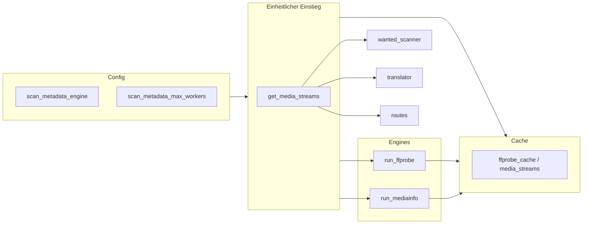

# Plan: Scan-Metadaten – MediaInfo + FFprobe einstellbar integrieren

## Sinn „beide behalten, einstellbar“

- **FFprobe** ist in der aktuellen Umgebung immer vorhanden (ffmpeg im Docker-Image) und wird heute überall genutzt; es soll Standard bleiben und ohne MediaInfo lauffähig sein.
- **MediaInfo** ist oft schneller bei reiner Metadaten-Auslese (header-fokussiert) und deckt den „schneller scannen“-Anwendungsfall ab.
- **Einstellbar** bedeutet: Nutzer können je nach Installation (MediaInfo vorhanden oder nicht) und Präferenz die Engine wählen; „Auto“ wählt MediaInfo falls verfügbar, sonst FFprobe.

Damit ist es sinnvoll, **beide Engines zu behalten** und über Einstellungen wählbar zu machen.

---

## Architektur-Überblick



- **Ein Einstieg:** Eine Funktion `get_media_streams(file_path, use_cache=True)` liefert immer das gleiche normalisierte Format (siehe unten).
- **Zwei Engines:** `run_ffprobe` (bestehend, erweitert) und neu `run_mediainfo` (MediaInfo CLI → gleiches Format).
- **Ein Cache:** Bestehender `ffprobe_cache` speichert das normalisierte Format; beide Engines schreiben dasselbe Schema, Cache bleibt engine-unabhängig (Cache-Einträge einer Engine sind für die andere gültig — gewollt, da das Format identisch ist; ein Engine-Wechsel erfordert kein Cache-Clear).

---

## 1. Einheitliches Stream-Format („probe-like“)

Alle bestehenden Consumer erwarten eine ffprobe-ähnliche Struktur. Das wird zum **vertraglichen Format** für beide Engines:

- `streams`: Array von Objekten mit mindestens:
  - `codec_type`: `"audio"` | `"subtitle"`
  - `codec_name`: z. B. `"ass"`, `"subrip"`, `"aac"`
  - `index`: Stream-Index
  - `tags`: Objekt mit optional `language`, `title`
  - für Untertitel/Forced: `disposition` mit z. B. `forced` (wie bei ffprobe)

Bestehende Nutzer ([ass_utils.has_target_language_stream](backend/ass_utils.py), [has_target_language_audio](backend/ass_utils.py), [select_best_subtitle_stream](backend/ass_utils.py), Wanted-Scanner, Translator, Routes) bleiben unverändert, sofern sie nur dieses Format bekommen.

---

## 2. Konfiguration

**Neue Einstellungen in** [backend/config.py](backend/config.py) (Pydantic Settings, `SUBLARR_`-Prefix):

- **scan_metadata_engine**: `"ffprobe"` | `"mediainfo"` | `"auto"`  
  - `auto`: MediaInfo verwenden, wenn `mediainfo` im PATH und ausführbar; sonst FFprobe.
- **scan_metadata_max_workers**: `int` (Default z. B. `4`)  
  - Steuert die maximale Parallelität beim Batch-Scan (aktuell [FFPROBE_MAX_WORKERS in wanted_scanner.py](backend/wanted_scanner.py) fest 4).

Optional: Runtime-Override über bestehende `config_entries`-DB und Config-API beibehalten, damit die Werte im UI änderbar sind (wie andere Einstellungen auch).

---

## 3. Backend-Implementierung

### 3.1 FFprobe reparieren (Bug Fix): Audio- und Untertitel-Streams in einem Aufruf

**Bestehender Bug:** `run_ffprobe` läuft aktuell mit `-select_streams s` → liefert **nur Untertitel-Streams**. `has_target_language_audio` prüft denselben `probe_data`-Dict auf `codec_type == "audio"` — findet aber nie Audio-Streams, da diese nicht abgefragt werden. **Audio-Erkennung im Wanted-Scanner ist damit defekt.**

**Fix:** `-select_streams s` entfernen. `ffprobe -v quiet -print_format json -show_streams <file>` liefert alle Stream-Typen (Audio + Untertitel + Video). Die bestehenden Consumer filtern selbst nach `codec_type`; das normalisierte Format bleibt identisch, alle Call-Sites bleiben unverändert.

`run_ffprobe` bleibt öffentlich (für internen `_batch_probe`-Einsatz), wird aber nicht mehr direkt von außen importiert — alle Call-Sites nutzen `get_media_streams`.

### 3.2 MediaInfo-Engine (neu): [backend/mediainfo_utils.py](backend/mediainfo_utils.py)

Separates Modul für klare Trennung.

#### 3.2.1 Codec-Mapping-Tabelle (kritisch für Korrektheit)

MediaInfo verwendet andere Format-Bezeichnungen als FFprobe:

| MediaInfo `Format`           | ffprobe `codec_name`   |
|-----------------------------|------------------------|
| `Advanced SubStation Alpha` | `ass`                  |
| `ASS`                       | `ass`                  |
| `SubStation Alpha`          | `ssa`                  |
| `SSA`                       | `ssa`                  |
| `UTF-8`                     | `subrip`               |
| `SubRip`                    | `subrip`               |
| `SRT`                       | `subrip`               |
| `VobSub`                    | `dvd_subtitle`         |
| `PGS`                       | `hdmv_pgs_subtitle`    |
| `PGSSub`                    | `hdmv_pgs_subtitle`    |
| `DVB Subtitle`              | `dvb_subtitle`         |
| `WebVTT`                    | `webvtt`               |
| `Timed Text`                | `mov_text`             |
| `AAC`                       | `aac`                  |
| `AC-3`                      | `ac3`                  |
| `E-AC-3`                    | `eac3`                 |
| `DTS`                       | `dts`                  |
| `DTS-HD MA`                 | `dts`                  |
| `TrueHD`                    | `truehd`               |
| `FLAC`                      | `flac`                 |
| `MP3`                       | `mp3`                  |
| `Opus`                      | `opus`                 |
| `Vorbis`                    | `vorbis`               |
| Unbekannte Werte             | Original-String (lower)|

#### 3.2.2 Forced-Disposition-Normalisierung

FFprobe gibt `”disposition”: {“forced”: 1}` (int). MediaInfo hat ein eigenes `”Forced”` Feld (`”Yes”` / `”No”`).

Normalisierung: `forced = track.get(“Forced”, “No”).strip().lower() == “yes”` → `”disposition”: {“forced”: 1 if forced else 0}`

#### 3.2.3 Subprocess-Sicherheit

```python
cmd = [“mediainfo”, “--Output=JSON”, file_path]  # list-arg, kein shell=True
subprocess.run(cmd, capture_output=True, text=True, timeout=30)
```

Dateipfad als Listen-Element übergeben verhindert Shell-Injection auch bei Leerzeichen und Sonderzeichen.

#### 3.2.4 Verfügbarkeits-Check (thread-safe)

```python
@functools.lru_cache(maxsize=1)
def _is_mediainfo_available() -> bool:
    return shutil.which(“mediainfo”) is not None
```

`lru_cache(maxsize=1)` wertet `shutil.which` nur einmal pro Prozess aus und ist durch den GIL thread-safe.

### 3.3 Einheitlicher Einstieg und Engine-Auswahl

- **Ort:** [backend/ass_utils.py](backend/ass_utils.py) (oder zentrales Modul „media_metadata“).
- **Neue Funktion:** `get_media_streams(file_path, use_cache=True) -> dict`:
  - Liest Einstellung `scan_metadata_engine` (über `get_settings()` bzw. Runtime-Config).
  - **auto:** Prüfen, ob `mediainfo` ausführbar ist (einmal pro Prozess oder mit kleinem TTL cachen); wenn ja → MediaInfo, sonst FFprobe.
  - **mediainfo** / **ffprobe:** entsprechende Engine aufrufen.
  - Cache: wie bisher mtime-basiert; Key weiterhin `(file_path, mtime)`; Inhalt das normalisierte `{"streams": [...]}`. Beide Engines schreiben dasselbe Format in den bestehenden Cache (z. B. `set_ffprobe_cache`/`get_ffprobe_cache` umbenennen oder intern weiterverwenden).
  - Bei Fehler/Timeout einer Engine: bei `auto` auf die andere Engine fallback (z. B. MediaInfo fehlgeschlagen → FFprobe); bei explizit gewählter Engine Fehler nach oben durchreichen.

### 3.4 Call-Sites auf einheitlichen Einstieg umstellen

| Datei | Stelle | Änderung |
|-------|--------|---------|
| [backend/wanted_scanner.py](backend/wanted_scanner.py) | Import + `_batch_ffprobe` + Einzelaufruf | `run_ffprobe` → `get_media_streams`; `_batch_ffprobe` → `_batch_probe`; `FFPROBE_MAX_WORKERS` → Config-Lesen |
| [backend/translator.py](backend/translator.py:829) | Zeile 829 | `run_ffprobe` → `get_media_streams` |
| [backend/providers/__init__.py](backend/providers/__init__.py:811) | Zeile 811 | `run_ffprobe` → `get_media_streams` |
| [backend/routes/wanted.py](backend/routes/wanted.py:982) | Zeile 982 | `run_ffprobe` → `get_media_streams` |
| [backend/services/ocr_extractor.py](backend/services/ocr_extractor.py:213) | Zeile 213 | `run_ffprobe` → `get_media_streams` |

**Batch-Warmup beibehalten:** `_batch_ffprobe` wird zu `_batch_probe` umbenannt; die parallele Cache-Warming-Logik (ThreadPoolExecutor) bleibt erhalten. Parallelität kommt jetzt aus der Config (`scan_metadata_max_workers`).

Wo **tatsächlich extrahiert** wird (z. B. `extract_subtitle_stream`, Whisper), bleibt der Aufruf zu ffmpeg/ffprobe bestehen; nur die **Metadaten-Beschaffung** läuft über `get_media_streams`.

### 3.5 Cache

- Bestehende Tabelle `FfprobeCache` (file_path, mtime, probe_data_json) weiterverwenden.
- **Cache ist engine-agnostisch:** Da beide Engines dasselbe normalisierte Format schreiben, sind Cache-Einträge einer Engine für die andere gültig. Ein Engine-Wechsel erfordert kein Cache-Clear. Dies ist gewollt.
- Gespeichert wird immer das normalisierte Format; Cache-Invalidierung weiter über `mtime`.
- Optionale Umbenennung in `media_streams_cache` (DB-Migration) ist kein Teil dieser Umsetzung.

---

## 4. Abhängigkeiten und Verfügbarkeit

- **FFprobe:** Bereits Voraussetzung (ffmpeg); keine Änderung.
- **MediaInfo:** Optional. Im Docker-Image kann `mediainfo` (CLI) ins Image aufgenommen werden (Dockerfile); ohne MediaInfo läuft alles weiter mit FFprobe (und `engine=auto` oder `engine=ffprobe`).
- **Erkennung:** Bei `engine=auto` einmal prüfen (z. B. `shutil.which("mediainfo")` oder Subprocess mit kurzem Timeout); Ergebnis ggf. pro Prozess cachen, um wiederholte Prüfungen zu vermeiden.

---

## 5. Frontend / API (kurz)

- Neue Einstellungen in der Config-API exposen (GET/PUT wie andere Settings), damit das bestehende Settings-UI sie anzeigen und setzen kann (inkl. Runtime-Override über config_entries, falls bereits genutzt).
- Kein neues UI-Feature nötig, sofern die bestehende Config-Seite generisch alle Einträge anzeigt; sonst zwei neue Felder für „Scan-Metadaten-Engine“ und „Scan-Metadaten Max Workers“ in der Settings-Ansicht ergänzen.

---

## 6. Tests

- **Unit:** `run_mediainfo` mit Mock-Subprocess oder festen MediaInfo-JSON-Samples; Prüfung, dass das normalisierte Format den Erwartungen von `has_target_language_stream` / `has_target_language_audio` / `select_best_subtitle_stream` entspricht.
- **Unit:** `get_media_streams` mit Mock-Engines: Verhalten für `engine=auto` (MediaInfo vorhanden/nicht vorhanden), `ffprobe`, `mediainfo`, und Cache-Treffer.
- **Integration:** Wanted-Scanner einmal mit `engine=mediainfo` und einmal mit `engine=ffprobe` (oder `auto`) durchlaufen lassen; gleiche „wanted“-Ergebnisse (gleiche fehlenden Sprachen/Streams).
- Bestehende Tests, die `run_ffprobe` mocken, auf `get_media_streams` umstellen (oder weiter `run_ffprobe` mocken, wenn der Einstieg intern noch ffprobe aufruft).

---

## 7. Reihenfolge der Umsetzung

1. Config erweitern: `scan_metadata_engine`, `scan_metadata_max_workers`.
2. **Bug Fix:** FFprobe in `ass_utils` ohne `-select_streams s` → liefert Audio- und Untertitel-Streams; Cache und Format unverändert kompatibel.
3. `get_media_streams` implementieren: zunächst nur FFprobe-Zweig, Config-Lesen, Cache.
4. Wanted-Scanner und alle anderen Call-Sites auf `get_media_streams` umstellen; `FFPROBE_MAX_WORKERS` durch Config ersetzen. **Hinweis:** `engine=mediainfo` gibt bis Schritt 5 einen `FileNotFoundError` zurück (kein stiller Fallback bei expliziter Wahl — erwartetes Verhalten).
5. MediaInfo-Modul `mediainfo_utils.py`: `run_mediainfo` + Normalisierung + Codec-Mapping; in `get_media_streams` einbinden (inkl. `auto` mit Fallback).
6. Config-API/Frontend für die neuen Einstellungen ergänzen.
7. Tests anpassen/erweitern.

Damit bleiben beide Engines erhalten, sind einstellbar, der Audio-Detection-Bug ist behoben, und der Scan kann bei vorhandenem MediaInfo schneller werden.
